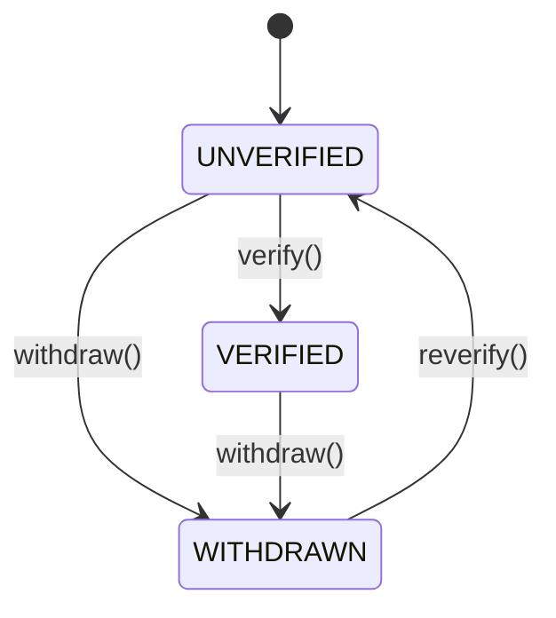

import Image from '@components/Image';

# 들어가며

모든 사물에는 상태가 있다. 그리고 모든 행동에는 순서가 있다. 소프트웨어도 마찬가지다. 다양한 객체가 유기적으로 연결되어 서로 영향을 주고받는다. 영향을 통해 객체의 상태가 변하고, 흐름이 생긴다. 이 흐름은 비즈니스 로직을 구성하는 핵심 요소다.

이때 우리는 흐름을 코드로만 해결하려 하며, 흐름 자체를 추상화하려 하진 않는다. 상태란 무엇인지, 어떻게 전이되는지, 어떤 제약을 갖는지를 표현하는 방법은 대부분 누락된다. 그 결과 흐름은 코드 전체에 흩어지고, 해석은 점점 어려워진다.

상태 머신은 흐름을 모델로 만드는 방법이다. 명확한 상태, 전이, 이벤트를 정의하고, 가능한 흐름만을 허용함으로써 코드의 예측 가능성과 신뢰성을 높여준다.

이번 장에서는 상태 머신이 무엇인지, 어떤 상황에 유용한지, 그리고 어떻게 더 복잡한 시스템을 표현하기 위해 모듈러 상태 머신을 통해 계층, 병렬 상태 머신으로 확장할 수 있는지를 다룬다.

# 비즈니스 흐름을 추상화 하는 방법

비즈니스 로직에는 흐름이 존재한다. 대표적으론 상품 구매 프로세스가 있다. 사용자는 상품을 장바구니에 담고, 결제하고, 배송받는다. 이 모든 과정이 한 번에 일어난다면 좋겠지만, 실제로는 여러 단계로 나뉘어 있고 중간에 그만두거나 취소할 수도 있다. 이처럼 비즈니스 흐름은 상태와 전이로 구성된다.

하지만 대부분의 흐름은 절차형 코드로만 표현되고 상태는 암묵적으로 존재한다. 가령 다음과 같은 코드에서 상태란 없다.

```kotlin
if (!user.isVerified) {
  throw IllegalStateException("User must be verified.")
}
```

그러나 실제로는 UNVERIFIED → VERIFIED로의 전이가 숨어 있다. 이를 코드를 통해 구체적으로 표현하면 다음과 같다.

```kotlin
enum class UserState {
  UNVERIFIED, VERIFIED, WITHDRAWN
}

data class User(
  val id: Long,
  val state: UserState
)

fun verify(user: User): User {
  require(user.state == UNVERIFIED)
  return user.copy(state = VERIFIED)
}
```

이 구조는 전이가 가능한 상태만 허용하고, 불가능한 전이에 대해선 즉시 실패하게 한다. 명시적으로 상태와 전이를 선언하면 다음과 같은 장점이 있다.
* 의도를 명확히 전달할 수 있다
* 불가능한 상태 전이를 방지할 수 있다
* 테스트와 시각화가 쉬워진다
* 유지보수가 쉬워진다

비즈니스 흐름은 결국 상태의 변화이며, 이를 구조화하면 복잡도는 낮아지고 예측 가능성은 높아진다. 이 장점은 단순한 유저 상태뿐 아니라 결제, 주문, 인증, 승인 등의 거의 모든 흐름에 적용할 수 있다.

# 유한 상태 머신이란?

이러한 상태와 전이를 표현하는 방법 중 하나가 유한 상태 머신(Finite State Machine, FSM)이다. 유한 상태 머신은 시스템의 상태를 유한한 집합으로 정의하고, 특정 이벤트에 따라 상태가 어떻게 전이되는지를 명시한 구조다. 상태 머신은 다음 네 가지 구성 요소로 이루어진다.

1. **State (상태)**<br />시스템이 가질 수 있는 유한한 상태들이다. 예를 들어, 주문 상태는 CREATED, PAID, SHIPPED, CANCELLED처럼 정의할 수 있다.
2. **Event (이벤트)**<br />상태 전이를 유발하는 외부 입력이다. 예를 들어, pay, ship, cancel 같은 사용자 행동이 여기에 해당한다.
3. **Transition (전이)**<br />특정 상태에서 특정 이벤트가 발생했을 때 어떤 상태로 이동하는지를 나타낸다. 예를 들어, CREATED 상태에서 pay 이벤트가 발생하면 PAID 상태로 전이된다.
4. **Context (문맥)**<br />상태와 전이만으로는 표현이 어려운 조건이나 부가 정보를 담는 데이터다. 예를 들어, 잔고가 충분해야 결제가 가능하다는 조건은 `context.balance >= amount`와 같은 식으로 표현될 수 있다.

이 네 가지 요소를 조합하면 상태 머신을 구성할 수 있다. 그리고 이러한 상태와 전이의 조합은 상태 다이어그램으로 시각화할 수 있다. 상태 다이어그램은 상태와 전이를 시각적으로 표현하여 시스템의 흐름을 이해하기 쉽게 만들어준다.



# 모듈러 상태 머신

실제 비즈니스는 단일 상태 머신만으로 표현하기엔 너무 복잡하다. 상품을 등록하는 프로세스와 검토하는 프로세스, 승인하는 프로세스는 각각 고유한 흐름을 가지며, 서로 영향을 주기도 한다. 이런 복잡한 흐름을 하나의 거대한 상태 머신으로 만들면 다음과 같은 문제가 발생한다.
* 상태가 기하급수적으로 늘어나고
* 전이 조건이 얽히고설켜
* 디버깅과 테스트가 어려워진다

이런 문제를 해결하기 위해 **모듈러 상태 머신(Modular State Machine)**이라는 개념이 등장한다. 모듈러 상태 머신은 상태 머신을 여러 개의 작은 상태 머신으로 분리하고, 이를 조합하거나 위임(Delegation)하는 방식으로 구성한다. 핵심 아이디어는 다음과 같다.
* 상태 머신을 기능별로 분리한다.
* 각 상태 머신은 독립적으로 동작하고, 상호작용이 필요할 때만 연결된다.
* 상태 전이를 외부에 노출하지 않고 캡슐화한다.

예를 들어 ProductWorkflow라는 상태 머신은 내부에 RegistrationStateMachine, ReviewStateMachine, ApprovalStateMachine을 가질 수 있다. 이때 ProductWorkflow는 상위 머신으로, 하위 머신들의 상태를 조합해 최종 상태를 구성한다.

```kotlin
data class ProductWorkflow(
  val registration: RegistrationState,
  val review: ReviewState,
  val approval: ApprovalState
)
```

모듈러 상태 머신은 복잡한 흐름을 분해하고, 각 상태 머신을 재사용 가능하고 테스트 가능한 단위로 만들 수 있도록 도와준다. 또한, 관심사를 분리하고 변경에 강한 구조를 갖출 수 있다.

# 병렬 상태 머신

서비스의 흐름은 종종 하나의 선형적인 절차로 끝나지 않는다. 동시에 여러 상태가 병렬적으로 관리되어야 할 때가 있다. 예를 들어 사용자가 진행 중인 강의를 수강하는 동시에, 과제를 제출하고, 시험을 치를 수도 있다. 이처럼 하나의 엔티티가 여러 상태를 동시에 가질 수 있다면 병렬 상태 머신이 필요하다.

```kotlin
enum class State {
  WATCHING_VIDEO,
  SUBMITTING_ASSIGNMENT,
  TAKING_EXAM
}
```

이런 식으로 상태를 하나만 표현하려고 하면, 동시에 여러 작업을 수행하는 시나리오를 표현할 수 없다. 상태가 섞이게 되고 관리가 어렵다.

병렬 상태 머신은 여러 개의 상태 머신을 동시에 실행하는 구조를 가진다. XState에서 다음과 같이 표현된다

```javascript
{
  "type": "parallel",
  "states": {
    "video": { "initial": "watching", ... },
    "assignment": { "initial": "notSubmitted", ... },
    "exam": { "initial": "notStarted", ... }
  }
}
```

Kotlin으로 모델링할 경우엔 다음과 같이 구성할 수 있다:

```kotlin
data class LearningSession(
  val video: VideoState,
  val assignment: AssignmentState,
  val exam: ExamState
)
```

각 속성은 별개의 상태 머신이며, 독립적으로 전이된다.

병렬 상태 머신이 유용한 경우
* 한 객체가 여러 상태를 동시에 가져야 할 때
* 서로 독립적인 하위 시스템이 동시에 동작해야 할 때
* 상태 전이 로직을 명확히 분리하고 싶을 때

병렬 상태 머신은 전체 시스템을 더 구조적으로 표현할 수 있게 해준다. 상호 의존성이 낮고, 테스트가 쉬우며, 각 하위 상태 머신은 독립적으로 설계·변경 가능하다.

# 계층 상태 머신

복잡한 시스템은 단순한 상태만으로 표현할 수 없다. 특히 하나의 상태 안에 다시 세부 상태가 존재할 때, 계층 상태 머신이 필요하다. 상태 안에 상태가 존재하는 구조, 이것이 계층(Hierarchical) 상태 머신이다.

예시: 결제 상태

결제 상태를 단순히 PENDING, SUCCESS, FAILURE로 나눈다고 해서 현실의 모든 흐름을 표현할 수는 없다. 예를 들어, 결제 PENDING 상태는 다시 세부적으로 나뉠 수 있다.
* PENDING
* AWAITING_PAYMENT_METHOD
* AWAITING_AUTHORIZATION
* AWAITING_CONFIRMATION

이 구조는 평면적인 상태 머신으로 표현하기 어렵다. 이럴 때 계층적 구조를 도입한다.

계층 상태 머신의 장점
* 상태의 범위를 명확하게 제한할 수 있다
* 내부 상태 전이는 외부와 격리시킬 수 있다
* 복잡한 흐름을 단순화해서 다룰 수 있다
* 각 서브 상태는 독립적으로 테스트 가능하다

계층 상태 머신은 시스템을 모듈화하고 복잡한 상태 전이를 안전하게 관리할 수 있게 해준다. 평면적 상태 머신이 감당할 수 없는 복잡도를 흡수하는 방식이다.

# 마치며

복잡한 흐름을 안전하게 제어하고자 할 때, 상태 머신은 강력한 해법이 된다. 단순한 유저 상태부터 주문 처리, 인증 플로우, 승인 절차, 결제 시스템까지 상태 기반 모델은 다양한 흐름에 적용 가능하다.

이번 장에서는 상태를 추상화하고, 전이를 명시하며, 흐름을 제약하는 방식을 소개했다. 그리고 이를 확장해 계층, 병렬, 모듈 단위로 분리하는 기법도 함께 다뤘다.

상태 머신은 단지 도구가 아니다. 흐름을 설계하는 사고 방식이다. 상태와 전이만으로 구성된 세상을 상상해보라. 조건문, 플래그, 타이머에 의존하던 혼란스러운 로직이 깔끔하게 정리되며, 흐름은 선명한 모델이 된다.

비즈니스 로직에 흐름이 존재한다면, 반드시 상태가 있다. 그 상태를 모델링하라. 모델링된 흐름은 읽을 수 있고, 테스트할 수 있고, 확장할 수 있다. 그리고 그 흐름은 곧 당신의 시스템을 이해 가능한 구조로 만든다.
